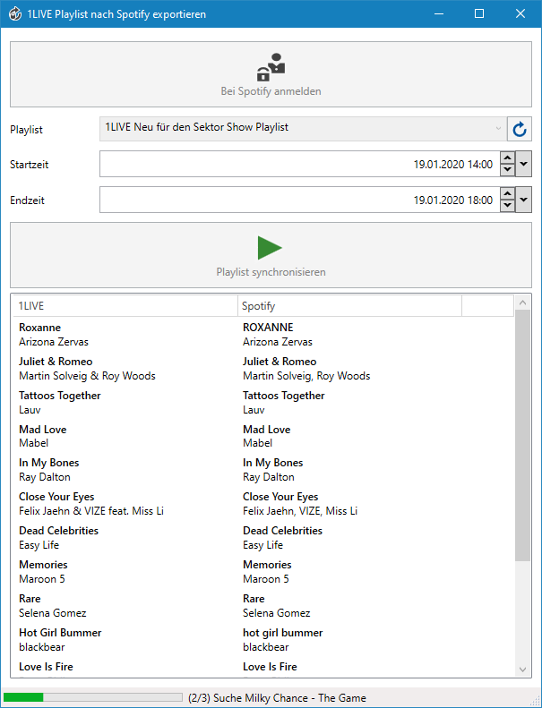

# 1LIVE Spotify Playlist Importer

Mit diesem Tool kann die 1LIVE Playlist abgerufen und in eine beliebige Spotify-Playlist importiert werden.

## Nutzung

1. [Anwendung](https://github.com/frostieDE/einslive-spotify-importer/releases) herunterladen und ausführen
2. In der Anwendung bei Spotify anmelden
3. Zielplaylist auswählen
4. Datum und Uhrzeit auswählen, zwischen denen die 1LIVE Playlist abgefragt wird
5. Warten
6. Musik bei Spotify genießen 😊

## Achtung

Die Suche des Tracks aus der 1LIVE Playlist bei Spotify hat keine 100%ige Trefferquote 😀

## Wichtig

Diese Anwendung wird **nicht** von 1LIVE oder dem Westdeutschen Rundfunk angeboten. Es handelt sich um ein privates Projekt eines 1LIVE-Höhrers.

## Lizenz

[MIT](LICENSE.md)

## Mitmachen

[Pull Requests](https://github.com/frostieDE/einslive-spotify-importer/pulls) oder [Fehler](https://github.com/frostieDE/einslive-spotify-importer/issues) sind immer willkommen 🎉
